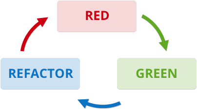

# **Hola!!, I'm Nico**
## **Web Developer**

<article>

### **Languages**

JavaScript

CSS3

HTML5

Markdown

</article>
 
<article>

### **Frameworks, Libraries, or like**

React & Redux

 

Jquery

Sass

Bootstrap

</article>
 
<article>

### **Test Driven Development**

Mocha & Chai

Jest & Enzyme for React Apps

Red-Green-Refactor technique

</article>
  
<article>

### **Tools**

Git & GitHub

NodeJS

Npm - Yarn

</article>

<!-- - **Web Development:** JavaScript(AJAX - API's), Jquery, React & Redux, CSS3, Sass, Bootstrap, HTML5, Markdown.
- **Test Driven Development**: Mocha, Chai, Assert Libraries, Jest, Enzyme (The last two for testing React Apps), and with RGR (Red-Green-Refactor) principle in mind.
- **What I use to work:** Git, GitHub, NodeJS, Npm, Yarn.
- **Other tools:** Google DevTools, Visual Studio Code, Bash Unix Shell & Windows PowerShell.
- **Web Design:** Figma for a Prototype or Wireframe of a project, or Designs.
- *I love Linux but I use Windows for work* -->

 
 

*I speak English and Spanish :)*

 

<section>

- In my career in programming, interacting with other programmers, and in so much self-learning too, I have acquired essentials **Soft Skills** too.
- **And the most important that I have acquired It's:** *Self-Learning(Self-taught learning)*, *Researching(Useful skill)*, *Problem-Solving(Too important)*, *Teamwork(working with other programmers)*, *a bit of leadership(I was leader in some projects)*.
- And while working with teams I learned that the *Positivity*, *Empathy*, *Responsibility* are the most important **soft skills** for a team members or leaders that I acquired.
                                              
                                              
         - I'm not only doing Web Projects (like Full stack, Single Page Applications, Web Sites, Web Applications, front-end or back-end), I'm doing other projects like node scripts or examples of test driven development that I'm uploading to my repositories.
             
             - If you want to talk with me, or if you want to contact me to work in some project, I will be pleased
             
             - Here my contact medias: 
             - Linkedin: www.linkedin.com/in/nicogamy
             - E-mail: madrazonecogamy@gmail.com

</section>